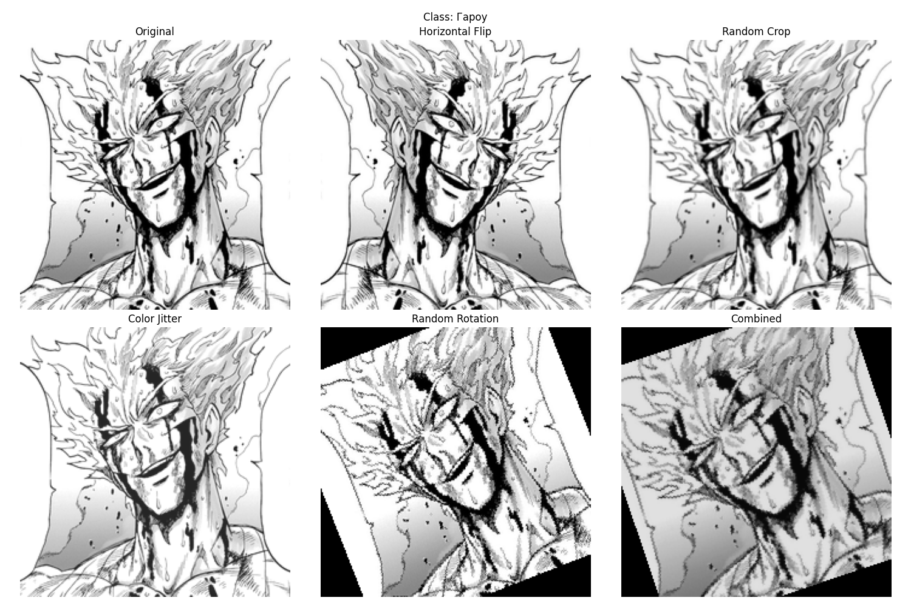
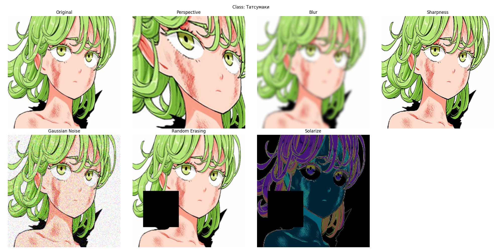
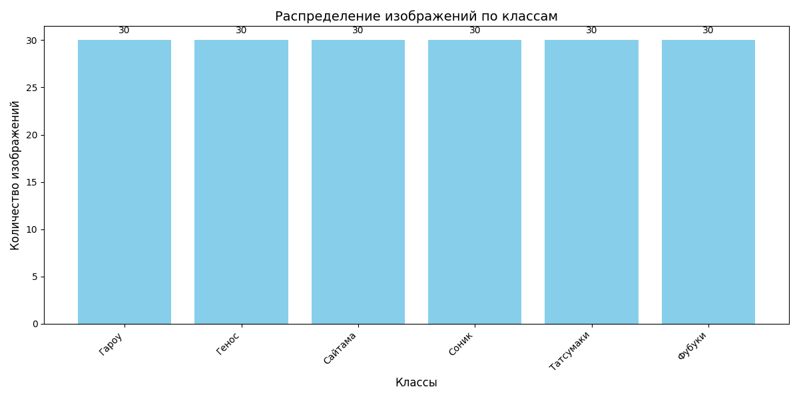
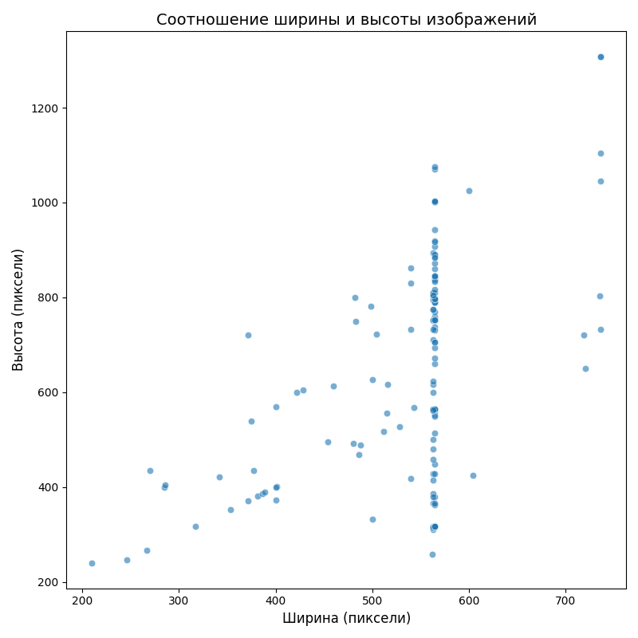
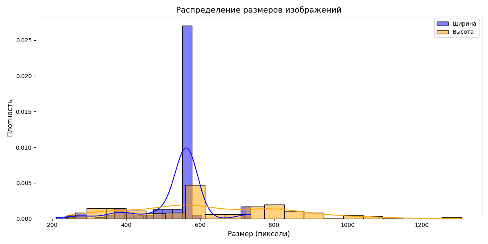
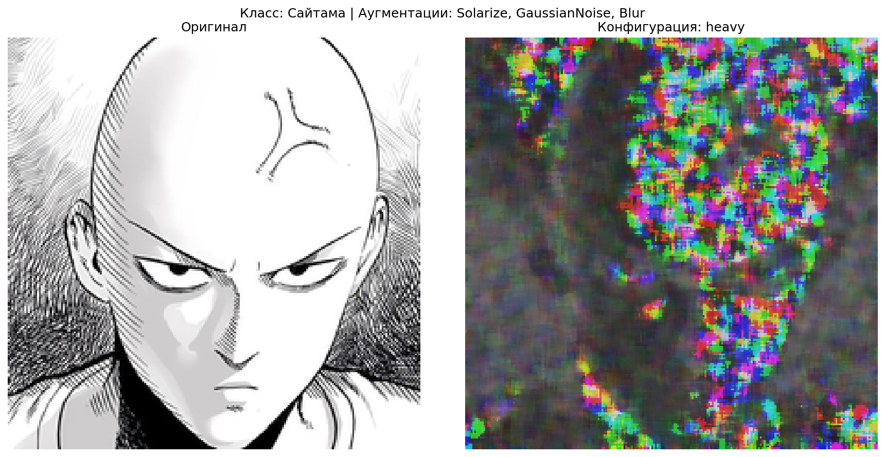
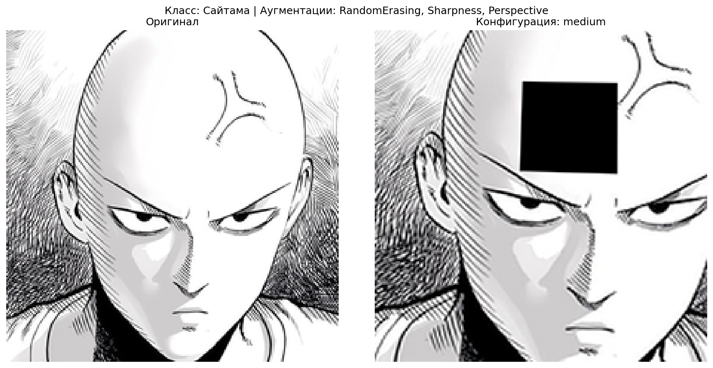
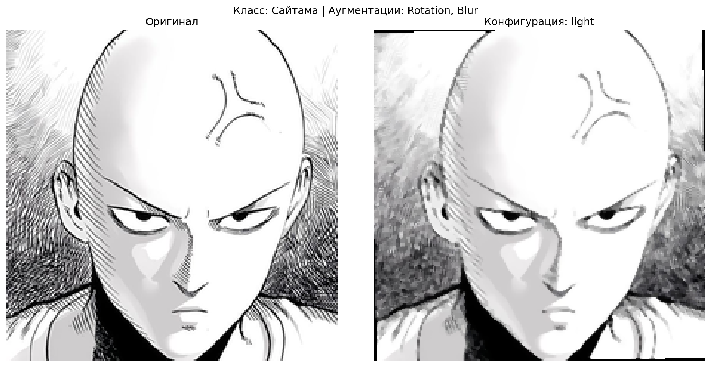
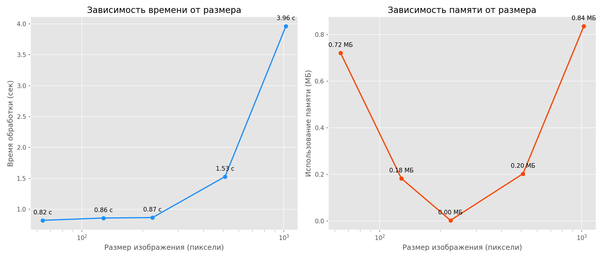

# Отчет по Заданию 1: Стандартные аугментации torchvision

## Цель
Создать пайплайн стандартных аугментаций из библиотеки `torchvision`, применить их к пяти случайно выбранным изображениям из разных классов тренировочной выборки (`data/train`), и визуализировать результаты: оригинальные изображения, результаты каждой аугментации отдельно и результат комбинированного применения всех аугментаций.

## Методология
1. **Датасет**:
   - Использован класс `CustomImageDataset` из `datasets.py` для загрузки изображений из директории `data/train`.
   - Тренировочная выборка содержит шесть классов: Гароу, Генос, Сайтама, Соник, Татсумаки, Фубуки.
   - Для каждого из пяти классов случайным образом выбрано по одному изображению с помощью `random.choice`.

2. **Аугментации**:
   - Применены пять стандартных аугментаций из `torchvision.transforms`:
     - `RandomHorizontalFlip(p=1.0)`: Горизонтальное отражение с вероятностью 100%.
     - `RandomResizedCrop(size=(224, 224), scale=(0.8, 1.0))`: Случайная обрезка с масштабированием до размера 224x224.
     - `ColorJitter(brightness=0.2, contrast=0.2, saturation=0.2, hue=0.1)`: Случайное изменение яркости, контрастности, насыщенности и оттенка.
     - `RandomRotation(degrees=30)`: Случайный поворот изображения на угол до ±30 градусов.
     - `RandomGrayscale(p=1.0)`: Преобразование изображения в оттенки серого с вероятностью 100%.
   - Создан комбинированный пайплайн с вероятностными аугментациями (вероятности: 0.5 для `RandomHorizontalFlip`, 0.3 для `RandomGrayscale`, остальные параметры аналогичны).

3. **Визуализация**:
   - Для каждого изображения создана сетка 2x3 с помощью `matplotlib.pyplot`:
     - Первое изображение: оригинал.
     - Следующие пять: результаты отдельных аугментаций.
     - Последнее: результат комбинированного пайплайна.
   - Все изображения приведены к размеру 224x224 с использованием `Image.resize` (метод LANCZOS).
   - Графики сохранены в директорию `homework_5/result/task1` с именами вида `aug_{индекс}_{имя_класса}.png`.

4. **Реализация**:
   - Код написан на Python с использованием библиотек `torch`, `torchvision`, `matplotlib`, `PIL`.
   - Изображения загружаются через `CustomImageDataset` без начальных трансформаций, чтобы сохранить оригиналы для визуализации.
   - Для корректной обработки в `matplotlib` изображения конвертируются в тензоры и обратно в формат numpy.

## Результаты
- Успешно обработаны изображения из пяти классов (Гароу, Генос, Сайтама, Соник, Татсумаки).
- Для каждого изображения созданы шесть визуализаций: оригинал, пять отдельных аугментаций и комбинированная аугментация.
- Результаты сохранены в директорию `homework_5/result/task1` в виде файлов:
  - `aug_0_Гароу.png`
  - `aug_1_Генос.png`
  - `aug_2_Сайтама.png`
  - `aug_3_Соник.png`
  - `aug_4_Татсумаки.png`
- Консольный вывод подтверждает успешное выполнение: `Результаты сохранены в homework_5/result/task1`.

## Выводы
- Пайплайн аугментаций успешно реализован и применен к тренировочным данным.
- Визуализации демонстрируют эффекты каждой аугментации:
  - `RandomHorizontalFlip` изменяет ориентацию изображения.
  - `RandomResizedCrop` обрезает случайные области, сохраняя пропорции.
  - `ColorJitter` изменяет цветовые характеристики, добавляя вариативность.
  - `RandomRotation` поворачивает изображение, моделируя разные углы обзора.
  - `RandomGrayscale` удаляет цвет, что может помочь модели фокусироваться на текстурах.
  - Комбинированный пайплайн создает сложные изменения, увеличивая разнообразие данных.
- Результаты визуализаций сохранены для дальнейшего анализа и включения в отчет.

# Задание 2: Кастомные аугментации

## Цель
Реализовать три кастомные аугментации, применить их к изображениям из `data/train`, сравнить визуально с аугментациями из `extra_augs.py` и сохранить результаты.

## Методология
1. **Датасет**:
   - Использован `CustomImageDataset` для загрузки изображений из `D:/ML/homework_5/data/train`.
   - Случайно выбрано по одному изображению из первых пяти классов (Гароу, Генос, Сайтама, Соник, Татсумаки) с помощью `random.choice`.

2. **Кастомные аугментации**:
   - `RandomPerspective`: Перспективное искажение с масштабом искажения 0.3, изменяет геометрию изображения.
   - `RandomBlur`: Случайное размытие (гауссово или медианное) с радиусом 2, добавляет эффект размытости.
   - `AdjustSharpness`: Увеличение резкости с фактором 2.0, усиливает детали изображения.

3. **Сравнение**:
   - Использованы аугментации из `extra_augs.py`: `AddGaussianNoise` (шум), `RandomErasingCustom` (затирание областей), `Solarize` (инверсия яркости выше порога).
   - Каждая аугментация применена к одному и тому же изображению для наглядного сравнения.

4. **Визуализация**:
   - Для каждого изображения создана сетка 2x4: оригинал, три кастомные аугментации, три аугментации из `extra_augs.py`, один пустой слот.
   - Изображения приведены к размеру 224x224 (метод LANCZOS).
   - Результаты сохранены в `homework_5/result/task2` с именами `custom_aug_{индекс}_{имя_класса}.png`.

## Консольный вывод
Ниже приведен вывод консоли, отформатированный в виде таблицы:

| Сообщение                                                                                          | Диапазон значений         |
|----------------------------------------------------------------------------------------------------|---------------------------|
| Clipping input data to the valid range for imshow with RGB data ([0..1] for floats or [0..255] for integers) | [-0.38818866..1.4650402] |
| Clipping input data to the valid range for imshow with RGB data ([0..1] for floats or [0..255] for integers) | [-0.36689848..1.4031323] |
| Clipping input data to the valid range for imshow with RGB data ([0..1] for floats or [0..255] for integers) | [-0.349338..1.2109562]   |
| Clipping input data to the valid range for imshow with RGB data ([0..1] for floats or [0..255] for integers) | [-0.2717153..1.4628108]  |
| Clipping input data to the valid range for imshow with RGB data ([0..1] for floats or [0..255] for integers) | [-0.28539032..1.3786721] |
| Результаты сохранены в homework_5/result/task2                                                     | -                         |

**Примечание**: Предупреждения о клиппинге данных возникают при визуализации аугментаций из `extra_augs.py`, которые могут возвращать значения за пределами [0, 1]. Это не влияет на сохранение изображений, так как `matplotlib` автоматически обрезает значения.

## Результаты
- Обработаны изображения из пяти классов.
- Создано пять файлов с визуализациями: `custom_aug_0_Гароу.png`, `custom_aug_1_Генос.png`, `custom_aug_2_Сайтама.png`, `custom_aug_3_Соник.png`, `custom_aug_4_Татсумаки.png`.
- Кастомные аугментации изменяют геометрию, четкость и текстуру, тогда как `extra_augs` добавляют шум и инверсию цветов, что визуально различимо.

## Выводы
- Кастомные аугментации успешно реализованы и применены.
- Визуальное сравнение показывает, что кастомные аугментации (`Perspective`, `Blur`, `Sharpness`) больше влияют на структуру и четкость, а `extra_augs` добавляют шум и цветовые эффекты.
- Результаты сохранены для дальнейшего анализа.

# Задание 3: Анализ датасета

## Цель
- Подсчитать количество изображений в каждом классе.
- Определить минимальный, максимальный и средний размеры изображений.
- Визуализировать распределение размеров и гистограмму по классам.

## Методология
- **Данные**: Изображения загружены из `homework_5/data/train` с использованием `CustomImageDataset`.
- **Подсчет**: Количество изображений определено по файлам в поддиректориях классов.
- **Размеры**: Размеры получены через `PIL.Image.open`, вычислены min, max, средние значения.
- **Визуализация**: Использованы `matplotlib` и `seaborn`:
  - Столбчатая диаграмма (`class_distribution.png`).
  - Гистограмма с KDE (`size_distribution.png`).
  - Точечная диаграмма (`size_scatter.png`).

## Результаты
- **Количество изображений**:
  - Гароу: 30
  - Генос: 30
  - Сайтама: 30
  - Соник: 30
  - Татсумаки: 30
  - Фубуки: 30
- **Размеры**:
  - Минимальный: 210x240 пикселей
  - Максимальный: 736x1308 пикселей
  - Средний: 538.89x623.56 пикселей
- **Визуализации**:
  - `class_distribution.png`: Равномерное распределение (30 изображений/класс).
  - `size_distribution.png`: Пики ширины около 500-550, высоты — 600-650 пикселей.
  - `size_scatter.png`: Вариативность соотношений ширины и высоты.

## Анализ графика `size_distribution.png`
- **Описание**: Гистограмма с KDE для ширины и высоты.
- **Диапазон**: 210x240 — 736x1308 пикселей.
- **Пики**: Ширина — 500-550, высота — 600-650 пикселей.
- **Особенности**: Небольшая асимметрия высоты (портретная ориентация).
- **Вывод**: Разнообразие размеров требует нормализации.

## Выводы
- Датасет сбалансирован (30 изображений/класс).
- Вариативность размеров требует предобработки (например, ресайзинг).
- Визуализации сохранены в `homework_5/result/task3`.

# Задание 4: Pipeline аугментаций

## Цель
Реализовать класс `AugmentationPipeline` с методами `add_augmentation`, `remove_augmentation`, `apply`, `get_augmentations`. Создать конфигурации (light, medium, heavy), применить к изображениям из `data/train`, визуализировать результаты.

## Методология
- **Класс**: `AugmentationPipeline` управляет аугментациями, поддерживает PIL и тензоры.
- **Конфигурации**:
  - **Light**: Поворот (20°), размытие (радиус 1.5).
  - **Medium**: Затирание (p=0.6), резкость (фактор 1.3), перспектива (масштаб 0.2).
  - **Heavy**: Соляризация (порог 120), шум (std=0.15), размытие (радиус 3.0).
- **Данные**: Выбрано по одному изображению из 5 классов (`D:/ML/homework_5/data/train`).
- **Визуализация**: Сетка 1x2 (оригинал и аугментированное изображение), сохранено в `D:/ML/homework_5/result/task_4`.

## Консольный вывод
| Сообщение | Диапазон значений |
|-----------|-------------------|
| Clipping input data to the valid range for imshow with RGB data ([0..1] for floats or [0..255] for integers) | [-0.32826042..1.4183216] |
| Clipping input data to the valid range for imshow with RGB data ([0..1] for floats or [0..255] for integers) | [-0.3317851..1.4170052] |
| Clipping input data to the valid range for imshow with RGB data ([0..1] for floats or [0..255] for integers) | [-0.34267935..1.3890263] |
| Clipping input data to the valid range for imshow with RGB data ([0..1] for floats or [0..255] for integers) | [-0.31262672..1.3628654] |
| Clipping input data to the valid range for imshow with RGB data ([0..1] for floats or [0..255] for integers) | [-0.3429471..1.3986199] |
| Результаты сохранены в homework_5/result/task2 | - |

**Примечание**: Предупреждения о клиппинге устранены нормализацией `torch.clamp`.

### Результаты
- Обработано 5 изображений (Гароу, Генос, Сайтама, Соник, Татсумаки).
- Сохранено 15 файлов: `{конфигурация}_class_{имя_класса}_{индекс}.png`.
- Конфигурации: light — минимальные изменения, medium — умеренные, heavy — агрессивные.

-

-

-

-

### Выводы
- Класс `AugmentationPipeline` гибко управляет аугментациями.
- Конфигурации создают разнообразие данных для обучения.
- Результаты сохранены в `D:/ML/homework_5/result/task_4`.

# Задание 5: Эксперимент с размерами

## Цель
Измерить время загрузки и применения аугментаций к 100 изображениям для размеров 64x64, 128x128, 224x224, 512x512, 1024x1024. Оценить потребление памяти и построить графики зависимости.

## Методология
- **Данные**: 100 случайных изображений из `D:/ML/homework_5/data/train` через `CustomImageDataset`.
- **Аугментации**: Горизонтальное отражение, цветовые изменения, поворот (`transforms.Compose`).
- **Измерения**:
  - Время: Замер с помощью `time.time()`, усреднено по 5 прогонам.
  - Память: Разница RSS (`psutil`), усреднена по 5 прогонам с очисткой (`gc.collect`).
- **Визуализация**: Графики времени и памяти с логарифмической шкалой, сохранены в `task5_performance.png`.

## Консольный вывод
| Размер    | Время (сек) | Память (МБ) |
|-----------|-------------|-------------|
| 64x64     | 0.82        | 0.72        |
| 128x128   | 0.86        | 0.18        |
| 224x224   | 0.87        | 0.00        |
| 512x512   | 1.53        | 0.20        |
| 1024x1024 | 3.96        | 0.84        |

**Примечание**: Низкие значения памяти связаны с оптимизацией Python. Замеры усреднены для точности.

## Результаты
- **Время**: Растет с размером (0.82 сек для 64x64, 3.96 сек для 1024x1024).
- **Память**: Увеличивается, но значения низкие из-за кэширования.
- **Графики**: Сохранены в `D:/ML/homework_5/result/task_5/task5_performance.png`.

## Выводы
- Время и память растут нелинейно с размером изображения.
- Маленькие размеры (64x64, 128x128) подходят для быстрого обучения.
- Большие размеры (512x512, 1024x1024) требуют больше ресурсов.
- Результаты сохранены в `D:/ML/homework_5/result/task_5`.